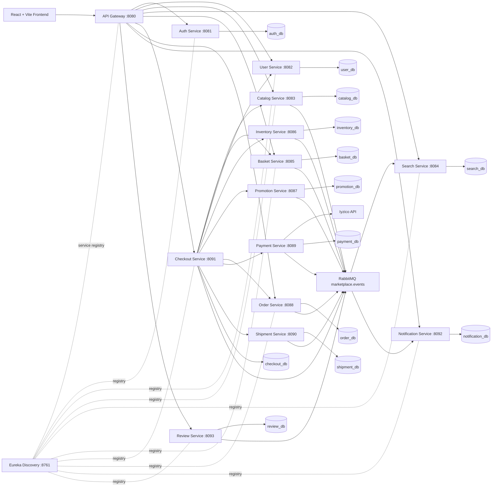
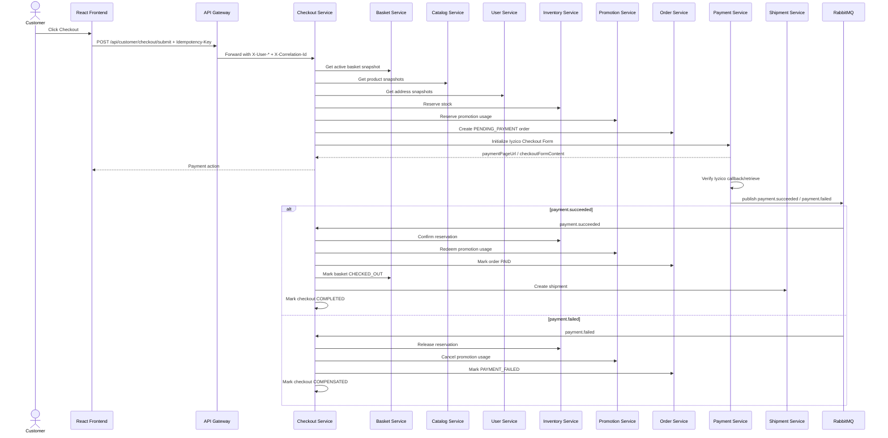

# Marketplace Microservices E-Commerce Platform

Spring Boot 3.5.x / Java 21 tabanlı, React + Vite frontend ile entegre olacak şekilde tasarlanmış **production-ready single-vendor e-commerce platform**.

Bu proje klasik “ürün listeleme + sepet + sipariş + ödeme” bootcamp isterlerini mikroservis mimarisiyle genişletir: API Gateway, Eureka service discovery, PostgreSQL-first persistence, RabbitMQ eventing, orchestrated Checkout Saga, Iyzico Checkout Form ödeme entegrasyonu, JWT + refresh token güvenliği, Swagger/OpenAPI, unit/integration testler, structured logging, Prometheus/Grafana observability, Jib image build ve GitHub Actions CI/CD.

> Ana karar: Bu proje **MVP shortcut** olarak değil, deploy edilebilir ve production’a yakın bir bootcamp final case olarak tasarlanmıştır.

---

## İçindekiler

- [Öne Çıkanlar](#öne-çıkanlar)
- [Mimari](#mimari)
- [Servisler](#servisler)
- [Ortak Modüller](#ortak-modüller)
- [Veri Sahipliği](#veri-sahipliği)
- [Checkout Saga](#checkout-saga)
- [RabbitMQ Event Modeli](#rabbitmq-event-modeli)
- [Search Service](#search-service)
- [Frontend](#frontend)
- [Hızlı Başlangıç](#hızlı-başlangıç)
- [Ortam Değişkenleri](#ortam-değişkenleri)
- [Güvenlik Modeli](#güvenlik-modeli)
- [Observability](#observability)
- [Test Stratejisi](#test-stratejisi)
- [CI/CD ve Deployment](#cicd-ve-deployment)
- [Mühendislik Standartları](#mühendislik-standartları)

---

## Öne Çıkanlar

- **Microservices architecture** — Her business capability kendi Spring Boot servisine ayrılmıştır.
- **Single-vendor e-commerce** — İlk release’te seller/store/multi-vendor karmaşıklığı yoktur.
- **API Gateway tek public giriş noktasıdır** — Frontend yalnızca Gateway ile konuşur.
- **Gateway-centric JWT security** — JWT doğrulaması Gateway’de yapılır; domain servisler Gateway’in ürettiği trusted `X-User-*` header’larını okur.
- **PostgreSQL-first persistence** — MongoDB, Elasticsearch ve Redis ilk sürümde kullanılmaz.
- **Search Service PostgreSQL FTS kullanır** — `tsvector`, `pg_trgm`, `unaccent`, JSONB indexleri ve relational indexlerle arama/listing yapılır.
- **Orchestrated Checkout Saga** — Checkout Service dağıtık satın alma akışını koordine eder.
- **Iyzico Checkout Form** — Kart verisi uygulama tarafından tutulmaz; ödeme provider adapter arkasına alınır.
- **RabbitMQ eventing** — Search projection, notification, lifecycle eventleri ve async side effect’ler için kullanılır.
- **Unit + integration tests** — Domain logic, controller behavior, Flyway/PostgreSQL schema validation ve idempotency senaryoları testlenir.
- **Observability-ready** — Actuator, Prometheus metrics, structured JSON logs, correlationId, Grafana/Loki/Jaeger altyapısına hazırdır.
- **Deployable** — Docker Compose, Jib, GitHub Actions, AWS Elastic Beanstalk/EC2 + RDS yönüyle tasarlanmıştır.

Bu projede özellikle **business ownership sınırları** net tutulmuştur. Basket fiyat/stock/discount authority değildir; Order checkout orchestrator değildir; Payment stock veya promotion finalize etmez; Search product source-of-truth değildir.

---

## Mimari



### Ana Mimari Kurallar

```text
Frontend yalnızca API Gateway ile konuşur.
Gateway JWT doğrular ve trusted user-context header üretir.
Domain servisler JWT parse etmez.
Her servis kendi veritabanı/schemasının sahibidir.
Servisler birbirlerinin database'ine erişmez.
Checkout orchestration-based Saga coordinator'dır.
RabbitMQ async projection/notification/lifecycle eventleri için kullanılır.
PostgreSQL ana persistence ve search altyapısıdır.
```

### Local Runtime Topology

| Bileşen | Port | Rol |
|---|---:|---|
| `discovery-service` | `8761` | Eureka Server / service registry |
| `api-gateway` | `8080` | Public backend entry point |
| `auth-service` | `8081` | Authentication, JWT, refresh token |
| `user-service` | `8082` | Profile, address, favorites, product lists |
| `catalog-service` | `8083` | Product/category/brand write model |
| `search-service` | `8084` | PostgreSQL FTS read model |
| `basket-service` | `8085` | Customer basket state |
| `inventory-service` | `8086` | Stock and reservation lifecycle |
| `promotion-service` | `8087` | Promotion/coupon/discount authority |
| `order-service` | `8088` | Immutable order and status lifecycle |
| `payment-service` | `8089` | Payment attempt/provider lifecycle |
| `shipment-service` | `8090` | Shipment and carrier lifecycle |
| `checkout-service` | `8091` | Orchestrated Saga coordinator |
| `notification-service` | `8092` | Event-driven notification inbox/delivery |
| `review-service` | `8093` | Product reviews and rating summaries |
| PostgreSQL | `5432` | Per-service databases/schemas |
| RabbitMQ | `5672`, `15672` | AMQP + management UI |
| Prometheus | `9090` | Metrics scrape |
| Grafana | `3000` | Dashboards |
| Loki | `3100` | Log aggregation |
| Jaeger | `16686` | Distributed tracing UI |

> Docker Compose host port’ları `.env` ile farklı expose edilebilir. Servislerin kendi container portları yukarıdaki topology’ye göre sabitlenmiştir.

---

## Servisler

| Servis | Port | Database | Temel Sorumluluk | Ana Endpoint Grupları |
|---|---:|---|---|---|
| `api-gateway` | `8080` | Yok | Routing, JWT validation, trusted header propagation, CORS, rate limiting | `/api/auth/**`, `/api/customer/**`, `/api/admin/**`, `/api/products/**`, `/api/search/**` |
| `discovery-service` | `8761` | Yok | Eureka registry ve discovery | `/`, `/eureka/**`, `/actuator/**` |
| `auth-service` | `8081` | `auth_db` | Register/login/JWT/refresh token/logout/password/account status | `/api/auth/register`, `/api/auth/login`, `/api/auth/refresh`, `/api/auth/logout`, `/api/auth/change-password`, `/api/auth/me` |
| `user-service` | `8082` | `user_db` | Profile, address, preferences, favorites, product lists | `/api/customer/profile/**`, `/api/customer/addresses/**`, `/api/customer/favorites/**`, `/api/customer/product-lists/**`, `/internal/users/**` |
| `catalog-service` | `8083` | `catalog_db` | Products, categories, brands, product snapshots | `/api/admin/products/**`, `/api/admin/categories/**`, `/api/admin/brands/**`, `/internal/catalog/**` |
| `search-service` | `8084` | `search_db` | Product listing/search/autocomplete/facets read model | `/api/products/search`, `/api/products/autocomplete`, `/api/products/facets`, `/api/search` |
| `basket-service` | `8085` | `basket_db` | Active basket and basket item lifecycle | `/api/customer/basket/**`, `/internal/baskets/**` |
| `inventory-service` | `8086` | `inventory_db` | Stock, reservation, confirm/release, stock movements | `/api/admin/inventory/**`, `/internal/inventory/reservations/**` |
| `promotion-service` | `8087` | `promotion_db` | Promotions, coupons, quote/reserve/redeem/cancel | `/api/admin/promotions/**`, `/api/admin/coupons/**`, `/api/customer/coupons/**`, `/internal/promotions/**` |
| `order-service` | `8088` | `order_db` | Immutable order record, snapshots, status lifecycle | `/api/customer/orders/**`, `/api/admin/orders/**`, `/internal/orders/**` |
| `payment-service` | `8089` | `payment_db` | Payment attempts, Iyzico adapter, callback, refund/cancel | `/internal/payments/**`, `/api/payments/providers/iyzico/checkout-form/callback`, `/api/admin/payments/**` |
| `shipment-service` | `8090` | `shipment_db` | Shipment creation, carrier abstraction, tracking/status lifecycle | `/internal/shipments/**`, `/api/customer/shipments/**`, `/api/admin/shipments/**` |
| `checkout-service` | `8091` | `checkout_db` | Quote, submit, Saga step tracking, finalization, compensation | `/api/customer/checkout/quote`, `/api/customer/checkout/submit`, `/api/admin/checkouts/**`, `/internal/checkouts/**` |
| `notification-service` | `8092` | `notification_db` | Event-driven notifications, inbox, templates, delivery retry | `/api/customer/notifications/**`, `/api/admin/notifications/**`, `/api/admin/notification-templates/**` |
| `review-service` | `8093` | `review_db` | Verified-purchase reviews, moderation, rating summaries | `/api/public/reviews/**`, `/api/customer/reviews/**`, `/api/admin/reviews/**` |

---

## Ortak Modüller

| Modül | Tip | Sorumluluk |
|---|---|---|
| `common-core` | Maven library | API response envelope, error model, pagination, base exceptions, constants, idempotency/correlation helpers |
| `common-events` | Maven library | Event envelope, event metadata, routing key constants, publisher/consumer contracts |
| `common-security` | Maven library | `CurrentUser`, trusted header parsing, role constants, `HeaderAuthenticationFilter`, ownership helpers |

Bu modüller business entity veya business rule taşımaz. Örneğin `common-core` içine `Product`, `Order`, `Basket`, `Coupon` gibi domain sınıfları konmaz. Her servis kendi domain modelinin sahibidir.

---

## Veri Sahipliği

| Domain | Source of Truth | Not |
|---|---|---|
| Account, password, roles, refresh token | `auth-service` | User profile bilgisi burada tutulmaz. |
| Profile, address, favorites, product lists | `user-service` | Auth ile aynı `userId` kullanılır. |
| Product, category, brand, base price, product attributes | `catalog-service` | Checkout authoritative product snapshot’ı buradan alır. |
| Product listing/search projection | `search-service` | Source of truth değildir; event-driven read modeldir. |
| Basket items | `basket-service` | Customer intent; stock/fiyat/discount guarantee etmez. |
| Stock and reservation | `inventory-service` | Oversell’i engellemek için reservation lifecycle burada yönetilir. |
| Promotions, coupons, discount quote/reservation | `promotion-service` | Coupon ownership User/Basket içinde tutulmaz. |
| Checkout session and Saga steps | `checkout-service` | Koordinatördür; domain state’leri sahiplenmez. |
| Order record and status | `order-service` | Immutable item/address/discount/payment/shipment snapshot tutar. |
| Payment attempt and provider result | `payment-service` | Iyzico provider logic burada adapter arkasındadır. |
| Shipment lifecycle | `shipment-service` | Order sadece shipment summary tutar. |
| Notification inbox/templates/delivery attempts | `notification-service` | Domain servisler direkt email/SMS göndermez. |
| Reviews and rating summaries | `review-service` | Search sadece rating projection tutar. |

---

## Checkout Saga

Checkout flow bu projedeki en kritik distributed transaction’dır. Tasarım **orchestration-based Saga** kullanır. Yani tüm servisler rastgele event kovalayarak checkout’u tamamlamaz; Checkout Service adımları bilerek ve sırayla koordine eder.

### Quote Flow — Read Only

```text
Customer → Checkout Quote
  ↓
Checkout gets active basket
  ↓
Checkout gets authoritative product snapshots from Catalog
  ↓
Checkout validates sellable products
  ↓
Checkout optionally gets address snapshot from User
  ↓
Checkout asks Promotion for quote
  ↓
Checkout calculates preview totals
  ↓
Checkout returns quote
```

Quote şunları yapmaz:

```text
stock reserve etmez
promotion usage reserve etmez
order oluşturmaz
payment başlatmaz
basket kapatmaz
```

### Submit Flow — State Changing

```text
Customer → POST /api/customer/checkout/submit + Idempotency-Key
  ↓
Checkout loads Basket snapshot
  ↓
Checkout loads Catalog product snapshots
  ↓
Checkout loads User address snapshots
  ↓
Checkout calculates deterministic totals
  ↓
Checkout reserves stock in Inventory
  ↓
Checkout reserves promotion/coupon usage in Promotion
  ↓
Checkout creates PENDING_PAYMENT order in Order Service
  ↓
Checkout initializes payment in Payment Service
  ↓
Payment Service returns Iyzico Checkout Form action
```

### Payment Success Finalization

```text
Payment Service verifies provider result
  ↓
Payment Service publishes payment.succeeded
  ↓
Checkout consumes verified payment event
  ↓
Checkout confirms inventory reservation
  ↓
Checkout redeems promotion usage
  ↓
Checkout marks order PAID
  ↓
Checkout marks basket CHECKED_OUT
  ↓
Checkout creates shipment
  ↓
Checkout marks session COMPLETED
```

### Payment Failure Compensation

```text
Payment Service verifies provider failure
  ↓
Payment Service publishes payment.failed
  ↓
Checkout releases inventory reservation
  ↓
Checkout cancels promotion usage reservation
  ↓
Checkout marks order PAYMENT_FAILED
  ↓
Checkout marks checkout COMPENSATED/FAILED
```

### Saga Sequence



### Idempotency

Critical operations use `Idempotency-Key` and request hash comparison:

```text
same key + same request body   → return existing result
same key + different body      → 409 conflict
same payment event twice       → second event ignored
same compensation twice        → no duplicate stock/promotion mutation
```

---

## RabbitMQ Event Modeli

Teknik event standardı `common-events` üzerinden verilir. Event’ler servisler arasında Java entity paylaşmaz; payload DTO/snapshot taşır.

Örnek envelope:

```json
{
  "eventId": "uuid",
  "eventType": "order.created",
  "correlationId": "uuid",
  "occurredAt": "2026-05-01T12:00:00Z",
  "source": "order-service",
  "payload": {}
}
```

Önerilen exchange:

```text
marketplace.events
```

Örnek routing key grupları:

| Event | Publisher | Consumer |
|---|---|---|
| `catalog.product.created` / `catalog.product.updated` | Catalog | Search, Notification optional |
| `inventory.stock.updated` / `inventory.stock.back_in_stock` | Inventory | Search, Notification |
| `promotion.coupon.assigned` | Promotion | Notification |
| `payment.payment.succeeded` / `payment.payment.failed` | Payment | Checkout, Notification optional |
| `order.order.created` / `order.order.paid` | Order | Notification |
| `shipment.shipment.created` / `shipment.shipment.shipped` / `shipment.shipment.delivered` | Shipment | Notification, Order sync/projection |
| `review.rating_summary.updated` | Review | Search |
| `checkout.checkout.completed` / `checkout.checkout.failed` | Checkout | Notification/admin alert optional |

Event consumers idempotent olmalıdır. Bunun için `processed_events` benzeri tablolarla `eventId` veya provider/event key dedup yapılır.

---

## Search Service

Bu projede Search Service Elasticsearch kullanmaz. Search, PostgreSQL-backed CQRS read model olarak tasarlanmıştır.

Search Service’in sahip olduğu şey:

```text
product_search_documents
searchVector / generated tsvector
brand/category/product projection fields
JSONB attributes
stock projection
promotion projection
rating projection
facets/autocomplete data
```

Search Service’in sahip olmadığı şey:

```text
product source of truth
price source of truth
stock source of truth
promotion source of truth
review source of truth
checkout validation
```

### Search Flow

```text
Catalog product write
  ↓
Catalog publishes catalog.product.* event
  ↓
Search consumes event
  ↓
Search upserts product_search_documents
  ↓
Frontend product listing/search reads Search Service
```

Inventory, Promotion ve Review eventleri de Search projection’ını patch eder:

```text
Inventory Service → stockStatus / availableQuantity projection
Promotion Service → promotionBadge / discountedPrice projection
Review Service    → averageRating / reviewCount projection
```

### Public Search Endpoints

```http
GET /api/products/search?q=iphone&page=0&size=20
GET /api/products/autocomplete?q=iph
GET /api/products/facets?q=phone
GET /api/search?q=iphone           # backward-compatible alias
```

### Important Rule

```text
Checkout Service never uses Search Service as authoritative product source.
Checkout always calls Catalog Service for product snapshots.
```

---

## Frontend

Frontend React + Vite SPA olarak planlanmıştır. Frontend yalnızca API Gateway’e istek atar; hiçbir mikroservis URL’i frontend içinde hardcode edilmez.

### Temel Sayfalar

| Route | Amaç |
|---|---|
| `/` | Home / product listing |
| `/products` | Listing + pagination + filters |
| `/products/:id` | Product detail |
| `/search?q=...` | Search results |
| `/basket` | Basket management |
| `/checkout` | Quote + submit checkout |
| `/login` | Login |
| `/register` | Register |
| `/customer/profile` | Profile |
| `/customer/orders` | Order history |
| `/customer/orders/:id` | Order detail |
| `/customer/favorites` | Favorites |
| `/customer/lists` | Product lists |
| `/customer/coupons` | Assigned coupons |
| `/admin/products` | Admin product management |
| `/admin/inventory` | Admin stock management |
| `/admin/orders` | Admin order management |
| `/admin/promotions` | Admin promotion/coupon management |

### Frontend API Rule

```text
VITE_API_BASE_URL=http://localhost:8080
```

Axios/fetch client bu base URL’i environment variable’dan okur. Hardcoded service portları frontend içine yazılmaz.

### Suggested Frontend Structure

```text
frontend/src/
├── api/
│   └── client.ts
├── components/
│   └── ui/
├── features/
│   ├── auth/
│   ├── catalog/
│   ├── search/
│   ├── basket/
│   ├── checkout/
│   ├── orders/
│   ├── profile/
│   ├── notifications/
│   └── reviews/
├── pages/
├── router/
└── store/
```

---

## Hızlı Başlangıç

### Gereksinimler

```text
Java 21
Maven 3.9+
Docker + Docker Compose
Node.js 20+
PostgreSQL 16 if running without Docker
RabbitMQ if running without Docker
```

### Tüm Sistemi Docker Compose ile Çalıştırma

```bash
# repository root
cp .env.example .env

docker compose up --build
```

Servisler ayağa kalkınca:

| URL | Ne? |
|---|---|
| `http://localhost:8080` | API Gateway |
| `http://localhost:8761` | Eureka dashboard |
| `http://localhost:15672` | RabbitMQ management UI |
| `http://localhost:9090` | Prometheus |
| `http://localhost:3000` | Grafana |
| `http://localhost:16686` | Jaeger UI |

> Production’da yalnızca API Gateway public expose edilmelidir. Domain servis portları, PostgreSQL, RabbitMQ management UI ve Eureka dashboard public internete açılmamalıdır.

### Tek Servis Çalıştırma

```bash
cd services/catalog-service
./mvnw spring-boot:run
```

veya root Maven reactor varsa:

```bash
mvn -pl services/catalog-service -am spring-boot:run
```

### Test Çalıştırma

Tek servis:

```bash
mvn -pl services/catalog-service -am test
```

Tüm servisler:

```bash
mvn test
```

Integration testler PostgreSQL Testcontainers kullandığı için Docker açık olmalıdır.

---

## Ortam Değişkenleri

### Ortak

| Değişken | Açıklama |
|---|---|
| `EUREKA_DEFAULT_ZONE` | Eureka server URL. Docker içinde `http://discovery-service:8761/eureka` |
| `RABBITMQ_HOST` | RabbitMQ host |
| `RABBITMQ_PORT` | RabbitMQ AMQP port |
| `RABBITMQ_USERNAME` | RabbitMQ username |
| `RABBITMQ_PASSWORD` | RabbitMQ password |
| `JWT_SECRET` | Auth Service token signing secret; production’da güçlü secret kullanılmalı |
| `IYZICO_API_KEY` | Iyzico API key |
| `IYZICO_SECRET_KEY` | Iyzico secret key |
| `IYZICO_BASE_URL` | Sandbox/prod Iyzico endpoint |
| `FRONTEND_BASE_URL` | Payment redirect URL’leri için frontend origin |

### Service-Specific Database Variables

| Servis | URL | Username | Password |
|---|---|---|---|
| Auth | `AUTH_DB_URL` | `AUTH_DB_USERNAME` | `AUTH_DB_PASSWORD` |
| User | `USER_DB_URL` | `USER_DB_USERNAME` | `USER_DB_PASSWORD` |
| Catalog | `CATALOG_DB_URL` | `CATALOG_DB_USERNAME` | `CATALOG_DB_PASSWORD` |
| Search | `SEARCH_DB_URL` | `SEARCH_DB_USERNAME` | `SEARCH_DB_PASSWORD` |
| Basket | `BASKET_DB_URL` | `BASKET_DB_USERNAME` | `BASKET_DB_PASSWORD` |
| Inventory | `INVENTORY_DB_URL` | `INVENTORY_DB_USERNAME` | `INVENTORY_DB_PASSWORD` |
| Promotion | `PROMOTION_DB_URL` | `PROMOTION_DB_USERNAME` | `PROMOTION_DB_PASSWORD` |
| Order | `ORDER_DB_URL` | `ORDER_DB_USERNAME` | `ORDER_DB_PASSWORD` |
| Payment | `PAYMENT_DB_URL` | `PAYMENT_DB_USERNAME` | `PAYMENT_DB_PASSWORD` |
| Shipment | `SHIPMENT_DB_URL` | `SHIPMENT_DB_USERNAME` | `SHIPMENT_DB_PASSWORD` |
| Checkout | `CHECKOUT_DB_URL` | `CHECKOUT_DB_USERNAME` | `CHECKOUT_DB_PASSWORD` |
| Notification | `NOTIFICATION_DB_URL` | `NOTIFICATION_DB_USERNAME` | `NOTIFICATION_DB_PASSWORD` |
| Review | `REVIEW_DB_URL` | `REVIEW_DB_USERNAME` | `REVIEW_DB_PASSWORD` |

---

## Güvenlik Modeli

### 1. Auth Service

Auth Service şunları yönetir:

```text
register
login
password hashing
JWT access token issuing
refresh token issuing
refresh token rotation
logout
logout-all
password change
account status
roles
```

Refresh token opaque random token olarak üretilir, DB’de hash olarak tutulur ve mümkünse HttpOnly cookie olarak client’a verilir.

### 2. API Gateway

Gateway’in görevleri:

```text
JWT validation
route-level role check
rate limiting
CORS
X-Correlation-Id propagation
incoming X-User-* headers stripping
trusted X-User-* headers recreation
/internal/** routes not exposed publicly
```

### 3. Domain Services

Domain servisler:

```text
JWT parse etmez.
Auth Service'e her request'te sormaz.
Gateway'in bastığı trusted X-User-Id / X-User-Email / X-User-Roles headerlarını okur.
Resource ownership check yapar.
Kendi SecurityConfig'inde customer/admin/internal route kurallarını uygular.
```

### 4. Internal Routes

`/internal/**` endpointleri servisler arası iletişim içindir. Bunlar public Gateway route’u olarak açılmamalıdır.

### 5. Secrets

Şunlar loglanmaz ve repository’ye commit edilmez:

```text
password / password hash
access token / refresh token
Authorization header
Iyzico secret key
card number / CVV
full address payloads
```

---

## Observability

### Metrics

Her Spring Boot servisi Actuator ve Micrometer ile health/metrics endpointleri açar:

```http
GET /actuator/health
GET /actuator/prometheus
```

Prometheus servisleri scrape eder, Grafana dashboard’ları servis health, request rate, latency, 5xx rate, JVM memory ve checkout/payment gibi business metriklerini gösterebilir.

### Logs

Logging standardı:

```text
SLF4J + Logback
structured JSON logs
correlationId
traceId optional
serviceName
eventName
errorCode on WARN/ERROR
```

Örnek log context:

```text
correlationId=...
userId=...
eventName=checkout.started
```

### Tracing

OpenTelemetry + Jaeger opsiyonel ama önerilir. Checkout flow gibi çok servisli akışlarda hangi downstream çağrının yavaşladığını veya nerede hata olduğunu görmek için kullanılır.

### Recommended Stack

```text
Prometheus → metrics
Grafana    → dashboards
Loki       → logs
Promtail   → Docker log collection
Jaeger     → traces
RabbitMQ UI → queue/debug visibility
Eureka UI  → service registry visibility
```

---

## Test Stratejisi

Bu projede testler üç seviyede düşünülür:

### Unit Tests

Business rule ve domain state transition testleri:

```text
order status transitions
inventory reserve/confirm/release lifecycle
promotion quote/reserve/redeem/cancel
basket quantity and idempotent remove/clear
payment provider status mapping
shipment status transitions
review rating summary arithmetic
notification delivery retry rules
```

### Integration Tests

PostgreSQL + Flyway + JPA validation testleri:

```text
Flyway migration applies cleanly
JPA entity mapping matches schema
ddl-auto validate passes
unique constraints work
partial unique indexes work where needed
JSONB columns persist/read correctly
```

### Controller Tests

MockMvc / SpringBootTest ile endpoint behavior:

```text
current user header usage
customer cannot access another customer's resource
admin endpoint authorization
validation errors
idempotency conflict responses
internal endpoint request/response contracts
```

### Örnek Komutlar

```bash
# Tek servis
mvn -pl services/payment-service -am test

# Tüm backend
mvn test
```

> Integration testler Testcontainers kullanıyorsa Docker açık olmalıdır.

---

## CI/CD ve Deployment

### CI/CD Pipeline

GitHub Actions pipeline hedefi:

```text
checkout source
run unit/integration tests
build services
build Jib images
push images
package deployment artifact
AWS deploy
Slack success/failure notification
```

### Containerization

Backend servisleri Jib ile Dockerfile yazmadan image haline getirilebilir:

```bash
mvn -pl services/order-service -am jib:dockerBuild
```

veya registry push:

```bash
mvn -pl services/order-service -am jib:build
```

### Deployment Hedefi

Bootcamp için pratik yön:

```text
AWS Elastic Beanstalk Docker platform
veya
EC2 + Docker Compose + RDS PostgreSQL
```

Önemli production kuralları:

```text
Only API Gateway is public.
PostgreSQL is private.
RabbitMQ management UI is private.
Eureka dashboard is private.
Secrets are injected through environment variables.
Service health is monitored through Actuator.
Deployment notifications go to Slack.
```

---

## Mühendislik Standartları

### Backend Package Style

Servislerde genel katmanlama:

```text
src/main/java/com/onatsubasi/finalcase/<service>/
├── presentation/
│   └── controller/
├── application/
│   ├── service/
│   ├── dto/
│   ├── mapper/
│   └── port/
├── domain/
│   ├── model/ or entity/
│   ├── repository/
│   ├── exception/
│   └── enums/
├── infrastructure/
│   ├── persistence/
│   ├── messaging/
│   ├── client/
│   └── provider/
└── config/
```

> Mevcut servislerde `domain/model` kullanıldıysa README bunu değiştirmez. Önemli olan servis içinde tutarlı package convention kullanılmasıdır.

### Controller Boundary

Her controller:

```text
@Valid request DTO kullanır
OpenAPI annotation içerir
ApiResponse/ErrorResponse standardına uyar
CurrentUser'ı header/security context üzerinden alır
frontend-provided userId'ye güvenmez
```

### Database

```text
Flyway migration mandatory
schema changes only through new V__ migration
spring.jpa.hibernate.ddl-auto=validate in production-like profiles
open-in-view=false
```

### Logging

```text
@Slf4j service/consumer/handler/adapter/scheduler/gateway filter üzerinde kullanılır
entity/DTO/enum/repository/mapper üzerinde kullanılmaz
sensitive data loglanmaz
correlationId her servis boyunca taşınır
```

### Resilience

Synchronous downstream çağrı yapan servisler Resilience4j circuit breaker kullanmalıdır. En kritik servis Checkout Service’tir; çünkü Basket, Catalog, User, Inventory, Promotion, Order, Payment ve Shipment servislerine bağımlıdır.

---

## Bootcamp Gereksinimi Karşılama

| Gereksinim | Projedeki Karşılık |
|---|---|
| Spring Boot backend | Her capability ayrı Spring Boot microservice |
| React frontend | React + Vite SPA |
| Product listing | Search Service + PostgreSQL FTS + pagination |
| Basket management | Basket Service |
| Order management | Order Service + Checkout Saga |
| Payment integration | Payment Service + Iyzico Checkout Form |
| PostgreSQL | Per-service PostgreSQL databases/schemas |
| JWT auth | Auth Service + API Gateway validation |
| Unit tests | Service-level domain/application tests |
| Integration tests | PostgreSQL Testcontainers + Flyway + controller tests |
| Swagger/OpenAPI | springdoc-openapi per service |
| Logging | SLF4J + Logback + structured JSON |
| Docker | Docker Compose topology |
| Jib | Container image build without Dockerfile |
| CI/CD | GitHub Actions build/test/deploy |
| AWS deployment | Elastic Beanstalk/EC2 + RDS direction |
| Monitoring | Actuator + Prometheus/Grafana + Slack deploy notifications |
| Nice-to-have | Review, Notification, Promotion/Coupon, Search projection, Observability |

---

## Önemli Tasarım Kararları

Bu proje özellikle şu “yanlış kolay yolları” kullanmaz:

```text
Basket stock azaltmaz.
Basket final price/discount hesaplamaz.
Order checkout orchestrator olmaz.
Payment inventory/promotion/order finalization yapmaz.
Search product source of truth olmaz.
User Service coupon ownership tutmaz.
Domain servisler JWT secret bilmez.
Frontend kritik fiyat/stock/discount değerlerinde trusted kabul edilmez.
```

Bunun yerine:

```text
Checkout Service distributed flow'u yönetir.
Catalog product source of truth olur.
Inventory stock source of truth olur.
Promotion discount/coupon source of truth olur.
Order immutable order snapshot/status lifecycle sahibi olur.
Payment provider/payment lifecycle sahibi olur.
Shipment delivery lifecycle sahibi olur.
Search event-driven read model olur.
Notification async side effect olur.
```

---

## Lisans / Not

Bu proje eğitim/bootcamp final case amacıyla geliştirilmiştir. Mimari production’a yakın tasarlanmıştır; gerçek production kullanımı için secrets management, infrastructure hardening, TLS, WAF, private networking, backup/restore, alerting ve provider credential güvenliği ayrıca tamamlanmalıdır.
